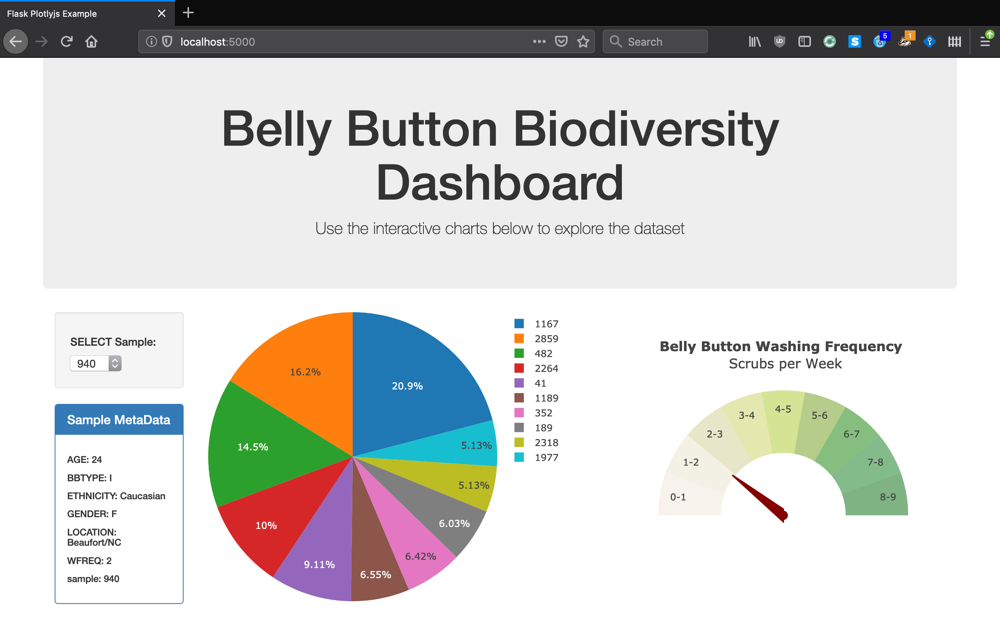

# Plot.ly - Belly Button Biodiversity

Build an interactive dashboard to explore the [Belly Button Biodiversity DataSet](http://robdunnlab.com/projects/belly-button-biodiversity/).

## Step 1 - Plotly.js

Use Plotly.js to build interactive charts for your dashboard.

* Create a PIE chart that uses data from your samples route (`/samples/<sample>`) to display the top 10 samples.

  * Use `sample_values` as the values for the PIE chart.

  * Use `otu_ids` as the labels for the pie chart.

  * Use `otu_labels` as the hovertext for the chart.

  

* Create a Bubble Chart that uses data from your samples route (`/samples/<sample>`) to display each sample.

  * Use `otu_ids` for the x values.

  * Use `sample_values` for the y values.

  * Use `sample_values` for the marker size.

  * Use `otu_ids` for the marker colors.

  * Use `otu_labels` for the text values.

  

* Display the sample metadata from the route `/metadata/<sample>`

* Display each key/value pair from the metadata JSON object somewhere on the page.

* Update all of the plots any time that a new sample is selected.

## Step 2 - Heroku

Deploy Flask app to Heroku.
Here is the link for Heroku app:
https://bhavinid-bellybtn-biodiversity.herokuapp.com/

- - -

## Advanced Challenge 

The following task is completely optional and is very advanced.

* Adapt the Gauge Chart from <https://plot.ly/javascript/gauge-charts/> to plot the Weekly Washing Frequency obtained from the `/metadata/<sample>`route.

* Account for values ranging from 0 - 9 for Gauge Chart.

* Update the chart whenever a new sample is selected.

- - -

## Flask API

Build Flask API to serve the data needed for your plots.

* Test all the routes by visiting each one in the browser.

